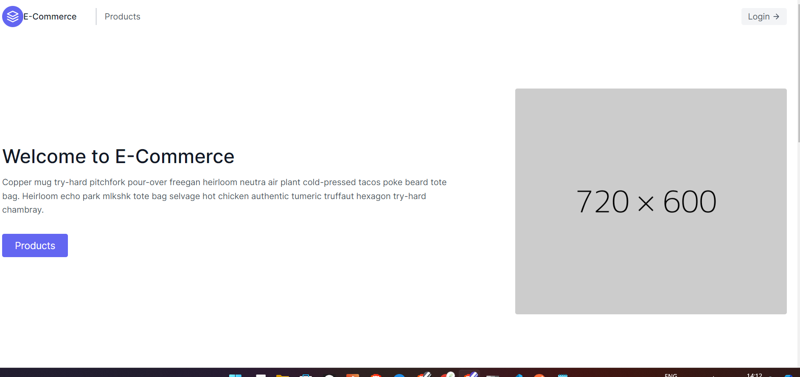
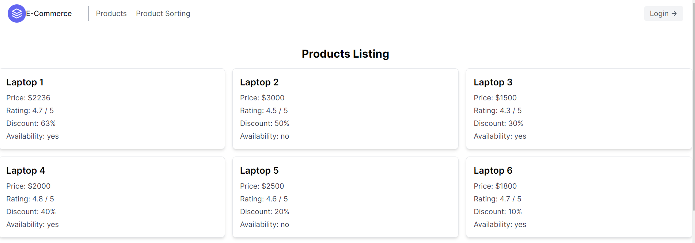
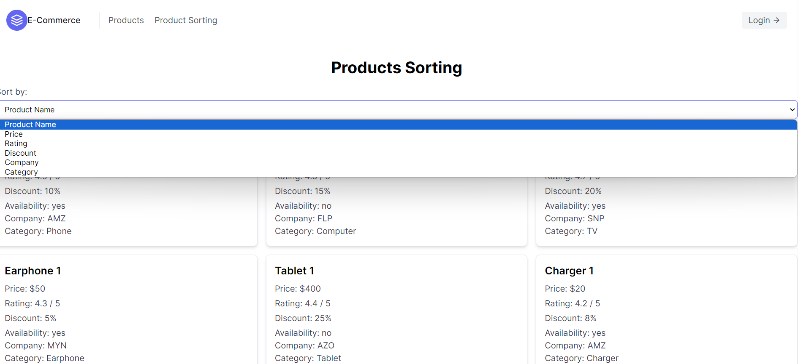
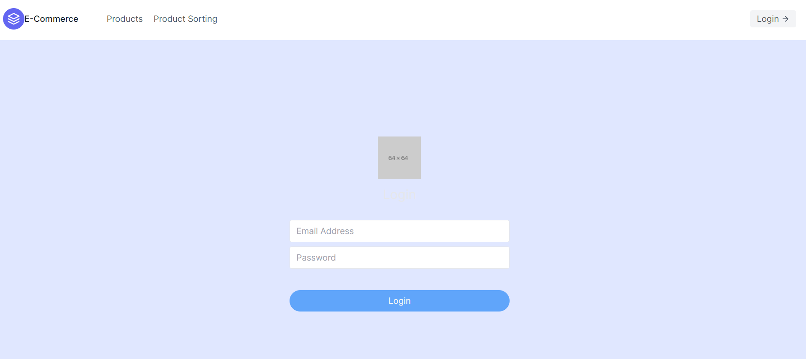
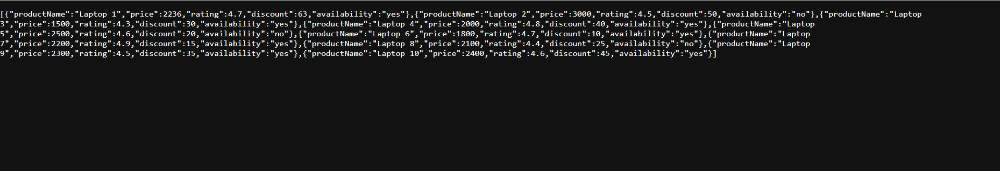

### Simple CRUD E-Commerce with Backend and the FrontEnd 


To Run the Backend
```
cd backend

npm run dev

```

To Run the FrontEnd 
```

cd frontend

npm run dev

```
## Tech Stack: 

### Backend:

```
Express Js
CORS
Bodyparser
Nodemon
```


### FrontEnd 
```
Next Js
Tailwind Css
Axios

```


FrontEnd: 



Listing of the Products 



Products Sorting



Login Page: 


Backend: 


Working of the API




